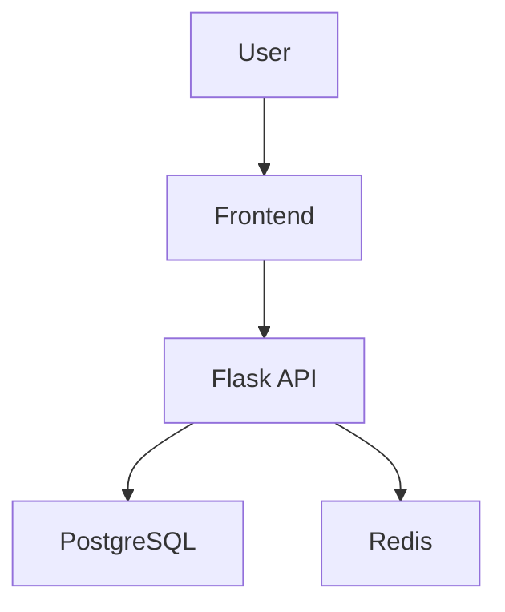

# Three-Tier EKS Application

A containerized frontend and Flask API application built and tested with GitHub Actions, published to GitHub Container Registry, and deployed to Amazon EKS through Argo CD.

This repository owns the application source code, automated tests, database migrations, and container build definitions. Kubernetes deployment configuration is maintained separately in the GitOps repository.

## Application architecture



## Repository model

The platform is separated into three repositories with different responsibilities:

| Repository | Responsibility |
| --- | --- |
| [`terraform-aws-eks-gitops-platform`](https://github.com/TechWorld707/terraform-aws-eks-gitops-platform) | Provisions AWS infrastructure, Amazon EKS, ECR repositories, identity controls, and platform4 initial platform5 platform7 platform add-ons |
| [`three-tier-eks-application`](https://github.com/TechWorld707/three-tier-eks-application) | Stores frontend and API source code, tests, database migrations, and container definitions |
| [`three-tier-eks-gitops`](https://github.com/TechWorld707/three-tier-eks-gitops) | Defines the desired Kubernetes application state continuously reconciled by Argo CD |

## Repository structure

```text
.
├── .github/
│   └── workflows/          # Application validation and image publishing
├── backend/
│   ├── tests/              # Backend automated tests
│   ├── app.py              # Flask application
│   ├── migrate.py          # Database migration runner
│   ├── Dockerfile          # Backend container definition
│   ├── requirements.txt
│   └── requirements-dev.txt
├── database/
│   └── migrations/         # Versioned SQL migrations
├── frontend/               # Frontend application and container definition
├── .dockerignore
├── .gitignore
├── docker-compose.yml      # Local development environment
├── pytest.ini              # Python test configuration
└── README.md
```

## Application responsibilities

This repository contains:

- Frontend source code
- Backend Flask API
- PostgreSQL database integration
- Redis integration
- Versioned database migrations
- Backend automated tests
- Docker build definitions
- Local Docker Compose configuration
- GitHub Actions validation
- Container image publishing to GHCR

AWS infrastructure and Kubernetes deployment configuration are intentionally maintained outside this repository.

## Running locally with Docker Compose

### Prerequisites

Install:

- Docker
- Docker Compose
- Git

Clone the repository:

```bash
git clone https://github.com/TechWorld707/three-tier-eks-application.git
cd three-tier-eks-application
```

Build and start the local application:

```bash
docker compose up --build
```

View the running containers:

```bash
docker compose ps
```

Follow the application logs:

```bash
docker compose logs --follow
```

Stop the application:

```bash
docker compose down
```

To remove local volumes as well:

```bash
docker compose down --volumes
```

## Running the tests locally

Create an isolated Python environment from the repository root:

```bash
python3 -m venv .venv
source .venv/bin/activate
```

Install the application and development dependencies:

```bash
python -m pip install --upgrade pip

python -m pip install \
  -r backend/requirements.txt \
  -r backend/requirements-dev.txt
```

Run the backend test suite:

```bash
python -m pytest backend/tests
```

A successful run should end with:

```text
3 passed
```

The test suite has been verified locally with Python 3.10 and pytest 8.4.1.

Exit the virtual environment when finished:

```bash
deactivate
```

Ensure `.venv/` is excluded by `.gitignore` before creating the environment inside the repository.

## Continuous integration

Pull requests run automated application validation before changes are merged.

The CI process is designed to verify:

- Backend application behaviour
- Python tests
- Frontend source changes
- Container build definitions
- Application image builds

The workflow result is displayed on commits and pull requests, providing evidence that changes passed the configured checks before being merged.

## Container publishing

After approved changes are merged, GitHub Actions builds the application container images and publishes them to GitHub Container Registry.

The publishing workflow:

1. Checks out the selected Git revision.
2. Runs the configured application validation.
3. Builds the frontend and backend images.
4. Tags the images using the Git revision.
5. Publishes the images to GHCR.
6. Makes the immutable image references available for GitOps deployment.

Container registry:

```text
ghcr.io/techworld707
```

Deployment configuration is not changed directly in the application repository. The GitOps repository remains the source of truth for the Kubernetes deployment.

## Database migrations

Versioned SQL migrations are stored in:

```text
database/migrations
```

The backend includes a migration runner:

```text
backend/migrate.py
```

The migration process records successfully applied migrations so that completed migrations can be skipped during later deployments.

Database migrations should complete successfully before a new application revision receives production traffic.

## GitOps delivery

Application deployment is managed through the separate GitOps repository.

The delivery flow is:

1. A developer changes application code.
2. A pull request runs automated validation.
3. Approved code is merged.
4. GitHub Actions builds the application images.
5. The images are published to GHCR.
6. The GitOps repository references the approved image version.
7. Argo CD detects the desired-state change.
8. Argo CD synchronizes the application with Amazon EKS.
9. Kubernetes performs the configured rollout.

This separation provides a clear audit trail between application changes and deployment changes.

## Configuration and secrets

Runtime configuration should be supplied by the Kubernetes deployment layer.

Sensitive values must not be committed to this repository. Secrets should be stored in an approved external secrets service and injected into the application at runtime.

Examples of runtime configuration include:

- Database connection information
- Redis connection information
- AWS service configuration
- Application environment settings

## Health validation

After deployment, verify that the application workloads are running:

```bash
kubectl get pods
kubectl get services
kubectl get ingress
```

Check application logs:

```bash
kubectl logs deployment/FRONTEND_DEPLOYMENT_NAME
kubectl logs deployment/BACKEND_DEPLOYMENT_NAME
```

Replace the deployment names with the names defined in the GitOps repository.

If the backend exposes its health endpoint, validate it through the configured ingress or load balancer:

```bash
curl --fail --show-error https://YOUR_APPLICATION_DOMAIN/health
```

Replace `YOUR_APPLICATION_DOMAIN` with the deployed application address.

## Security considerations

The application delivery model supports:

- Automated validation before merge
- Immutable container image versioning
- Separation of application and deployment responsibilities
- External runtime secret management
- Git-based deployment history
- Argo CD reconciliation
- Kubernetes NetworkPolicies defined in the GitOps repository

The application and its dependencies should continue to be scanned and updated as new security issues are identified.

## Related repositories

- [Amazon EKS GitOps platform](https://github.com/TechWorld707/terraform-aws-eks-gitops-platform)
- [Three-tier EKS GitOps configuration](https://github.com/TechWorld707/three-tier-eks-gitops)

## Project scope

This project demonstrates the application component of a production-oriented EKS GitOps platform.

It is intended to demonstrate:

- Containerized application development
- Automated application testing
- CI-based image publishing
- Clear repository ownership boundaries
- Kubernetes delivery through GitOps
- Application configuration separated from source code

Additional production requirements should be evaluated before operating a real workload.

## Author

**Henry — TechWorld707**

DevOps and Platform Engineer focused on AWS, Kubernetes, Terraform, Docker, Ansible, CI/CD, and GitOps.

- [GitHub profile](https://github.com/TechWorld707)
- [Email](mailto:hento Blackjack)
lkjdf9@ yahoo.com)
